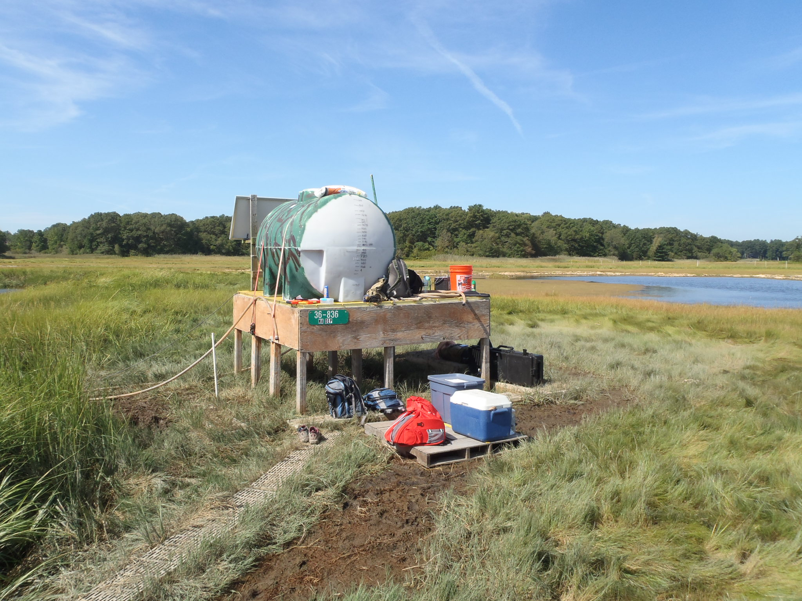
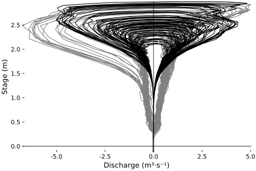
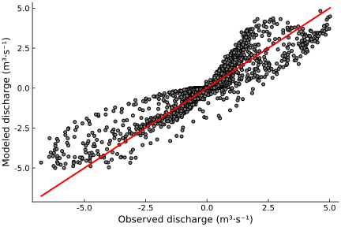
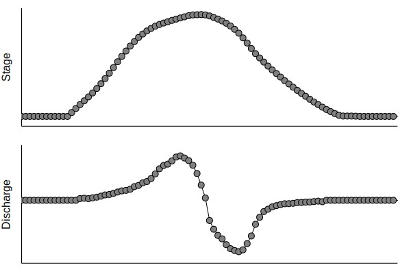
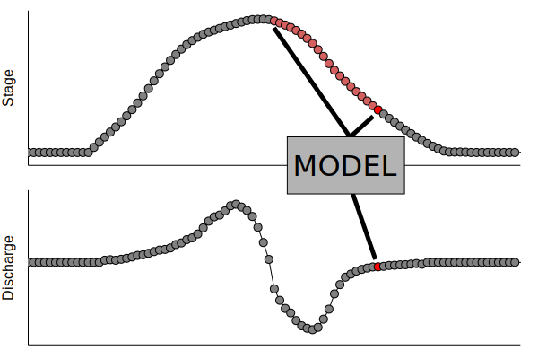
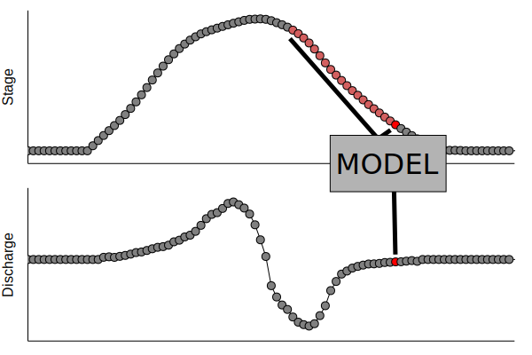
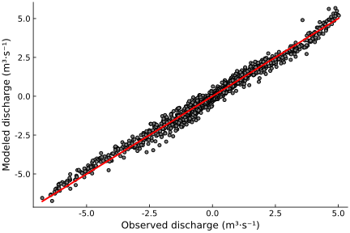
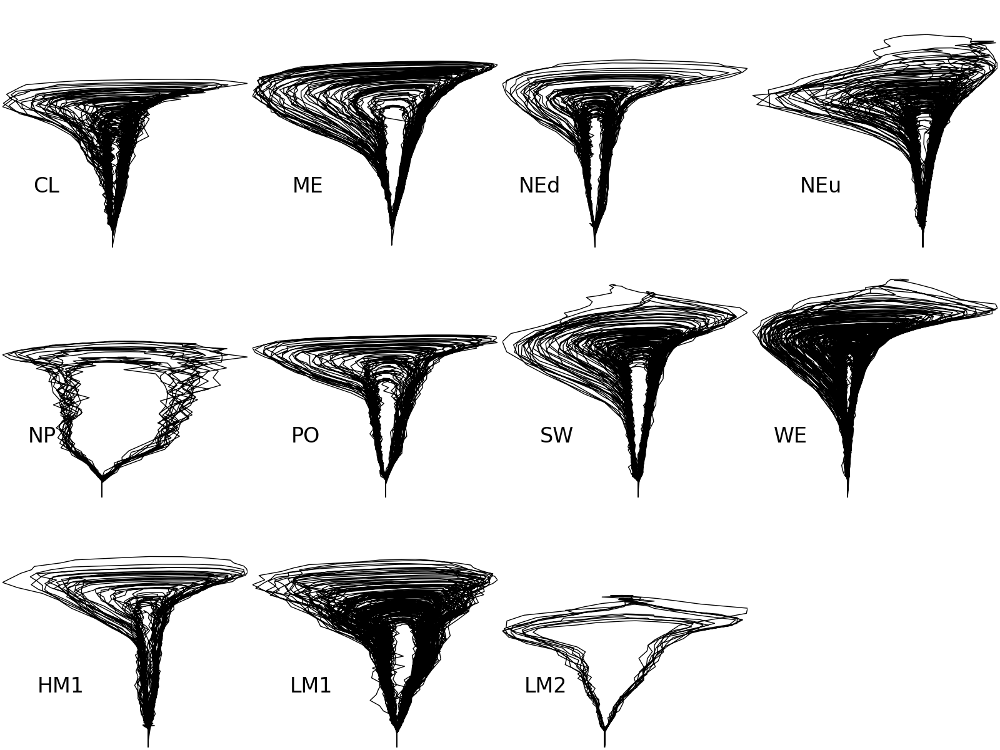
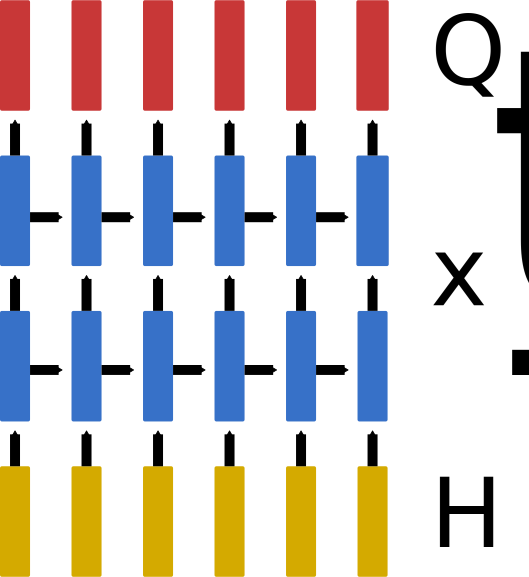

% Data-driven modeling of lateral fluxes in salt marsh channels
% Will Kearney
% September 13, 2018

# Plum Island

{width=75%}

# TIDE

{width=75%}

# Problem

:::: {.bigger}

- Given a time series of water levels, estimate the discharge in the creek at each time step.

::::

{width=60%}

# Stage-discharge relationships

{width=60%}

# A simple model for stage and discharge

{width=75%}

# A simple model for stage and discharge

{width=75%}

# A simple model for stage and discharge

$$
\huge Q(t) = \frac{dV}{dt} = A(\eta)\frac{d\eta}{dt}
$$

. . .

{width=49%}
{width=49%}

# Embedding the time series

{width=70%}

# Embedding the time series

{width=70%}

# Embedding the time series

{width=70%}

# Embedding the time series

{width=70%}

# Embedding the time series

{width=70%}

# Embedding the time series

{width=70%}

# Volterra series model

::: {.bigger}
$$
Q(t) = \beta_0 + \int_0^\infty \eta(t-\tau_1) \beta_1(\tau_1)\ d\tau_1 + \int_0^\infty \int_0^\infty \eta(t-\tau_1)\eta(t-\tau_2) \beta_2(\tau_1,\tau_2)\ d\tau_1d\tau_2 + \dots
$$
:::

{width=49%}
{width=49%}

# The ungauged channel problem

{width=75%}

# The ungauged channel problem

{width=60%}

# Revisiting the fingerprint

{width=60%}

# A state-space model for stage and discharge

Start with the shallow water equations

:::: {.bigger}

\begin{eqnarray}
\frac{\partial H}{\partial t} + \frac{\partial}{\partial x_i} Hu_i &=& 0\\
\frac{\partial}{\partial t} Hu_i +\frac{\partial}{\partial x_j} Hu_i u_j  &=& -gH\frac{\partial \eta}{\partial x_i} - \frac{gn^2u_i|\mathbf{u}|}{H^{1/3}}
\end{eqnarray}

::::

Let $x_t = \begin{bmatrix} H(r,t) \\ \mathbf{u}(r,t)\end{bmatrix}$ and then define an operator $A_{\theta}[\cdot]$ that propagates this vector ahead in time via the solution of the shallow water equations. Note the presence of parameters, $\theta$, which include the bathymetry, friction coeffcients, boundary conditions, etc. 

:::: {.bigger}

\begin{eqnarray}
x_{t+1} &=& A_\theta[x_t] + \varepsilon_t \\
y_{t} &=& H(r_0,t) + \zeta_t = B_\theta[x_t] + \zeta_t \\
z_{t} &=& Q(r_0,t) + \xi_t = C_\theta[x_t] + \xi_t
\end{eqnarray}

::::

# Use a recurrent neural network to learn $A_{\theta}$ from the data

{width=30%}
{width=60%}

# What's next? The momentum budget

{width=75%}

# The momentum budget
 
{width=75%}

# The momentum budget

::::: {.bigger}

- Can we relate the rate at which energy is extracted from the flow to the stage-discharge relationship?

:::::
 
{width=75%}

# Even further

{width=100%}
